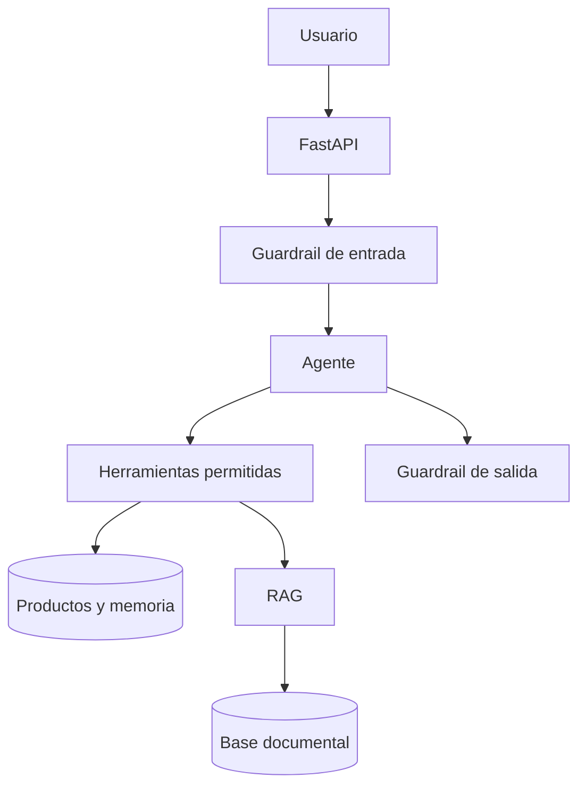

# Ferretería Generative AI

[](https://github.com/gus-ale/ferreteria-generative-ai/actions/workflows/ci.yml)
[](https://www.python.org/)
[](https://fastapi.tiangolo.com/)
[](https://developers.openai.com/api/docs/guides/text)
[](LICENSE)

**Production-oriented Generative AI portfolio project for a hardware store.**

Asistente inteligente que integra FastAPI, OpenAI Responses API, RAG,
function calling, memoria conversacional, guardrails, evaluaciones,
observabilidad, MySQL y Docker.

El repositorio demuestra el trabajo de un **Generative AI Engineer** más allá
de un chatbot: separa recuperación y generación, mantiene las herramientas
bajo control del backend, persiste conversaciones, mide el comportamiento y
ofrece un modo de demostración reproducible sin credenciales ni consumo.

> Los productos, precios, stock, manuales y garantías incluidos son sintéticos.
> El proyecto tiene fines educativos y de portfolio.

## Capacidades

- API con FastAPI, OpenAPI, Swagger y contratos Pydantic.
- Dos proveedores intercambiables:
  - `demo`: ejecución offline, determinística y sin costo.
  - `openai`: Responses API, function calling y embeddings reales.
- RAG con ingesta, chunking, embeddings, búsqueda por coseno y citas.
- Herramientas permitidas:
  - `search_products`
  - `get_stock`
  - `search_knowledge`
- Memoria conversacional persistida en SQL.
- Guardrails de entrada, herramientas y salida.
- Herramientas de solo lectura para limitar efectos laterales.
- Límite de turnos del agente.
- Identificador de petición y logs JSON.
- Métricas Prometheus en `/metrics`.
- Liveness y readiness separados.
- MySQL 8.4 en Docker y SQLite para desarrollo.
- Migraciones de esquema con Alembic.
- Dataset de evals y ejecutor de regresión.
- Pruebas automatizadas con modo OpenAI sustituido por el proveedor demo.
- CI con lint, cobertura, evals y construcción de la imagen.

## Arquitectura



El modelo propone llamadas a herramientas, pero el backend valida los
argumentos y ejecuta únicamente funciones de una allowlist. Los documentos
recuperados se tratan como datos no confiables, nunca como permisos.

Más detalle en [Arquitectura y decisiones](docs/architecture.md).

## Inicio rápido sin OpenAI

Requisitos:

- Python 3.11 o superior.
- Git.

Crear el entorno:

```bash
python -m venv .venv
source .venv/bin/activate
python -m pip install -r requirements-dev.txt
cp .env.example .env
```

La configuración de ejemplo ya usa:

```env
AI_PROVIDER=demo
EMBEDDING_PROVIDER=local
```

Iniciar:

```bash
uvicorn app.main:app --reload
```

Abrir:

| Recurso | Dirección |
|---|---|
| Swagger UI | http://localhost:8000/docs |
| ReDoc | http://localhost:8000/redoc |
| Readiness | http://localhost:8000/api/v1/health/ready |
| Métricas | http://localhost:8000/metrics |

El modo demo carga cuatro productos y un manual técnico sintético.

## Activar OpenAI

Modificar `.env`:

```env
AI_PROVIDER=openai
EMBEDDING_PROVIDER=openai
OPENAI_API_KEY=tu_clave
OPENAI_MODEL=un_modelo_compatible_con_responses_y_tools
OPENAI_EMBEDDING_MODEL=text-embedding-3-small
```

El modelo queda en configuración, no fijado en el código. Así puede cambiarse
sin modificar la aplicación y evaluarse antes de promover una versión.

La clave:

- No se envía al navegador.
- No se incluye en Docker.
- No se sube a GitHub.
- Se mantiene en el backend mediante variables o un gestor de secretos.

## Ejemplos

### Consultar stock mediante el agente

```bash
curl -X POST http://localhost:8000/api/v1/chat \
  -H "Content-Type: application/json" \
  -d '{"message":"¿Cuánto stock queda del martillo M20?"}'
```

Respuesta abreviada:

```json
{
  "answer": "Stock encontrado:\n- Martillo carpintero M20: 18 unidades",
  "provider": "demo",
  "tools_used": [
    {
      "name": "search_products",
      "arguments": {"query": "martillo m20", "limit": 5}
    }
  ],
  "citations": []
}
```

### Consulta RAG con citas

```bash
curl -X POST http://localhost:8000/api/v1/chat \
  -H "Content-Type: application/json" \
  -d '{"message":"¿Qué garantía tiene el taladro T700?"}'
```

### Indexar un documento

Los endpoints de escritura requieren `X-Admin-Key`:

```bash
curl -X POST http://localhost:8000/api/v1/knowledge/documents \
  -H "Content-Type: application/json" \
  -H "X-Admin-Key: development-admin-key-change-me" \
  -d '{
    "title": "Manual de pintura exterior",
    "source": "manuales/pintura-exterior",
    "content": "Documento técnico de al menos veinte caracteres...",
    "metadata": {"categoria": "pinturas"}
  }'
```

Antes de exponer el proyecto se debe reemplazar la clave administrativa.
Hay más ejemplos en [Ejemplos de API](docs/api-examples.md).

## Endpoints

| Método | Endpoint | Función | Protección |
|---|---|---|---|
| `GET` | `/api/v1/health/live` | Proceso vivo | Pública |
| `GET` | `/api/v1/health/ready` | DB y proveedores configurados | Pública |
| `GET` | `/api/v1/products` | Buscar productos | Pública |
| `POST` | `/api/v1/products` | Crear producto | `X-Admin-Key` |
| `POST` | `/api/v1/knowledge/documents` | Indexar documento | `X-Admin-Key` |
| `POST` | `/api/v1/knowledge/search` | Buscar fragmentos | Pública |
| `POST` | `/api/v1/chat` | Conversar con el agente | Pública |
| `GET` | `/api/v1/chat/conversations/{id}` | Inspeccionar memoria | Pública demo |
| `GET` | `/metrics` | Métricas Prometheus | Restringir en producción |

En una aplicación comercial, el chat y la memoria también deben asociarse a
un usuario autenticado. La API key administrativa demuestra la frontera de
autorización sin convertir el portfolio en otro proyecto completo de identidad.

## Flujo RAG

1. Recibe un documento.
2. Normaliza el texto.
3. Lo divide con solapamiento.
4. Genera un embedding por fragmento.
5. Persiste contenido, vector, metadatos y fuente.
6. Embebe la consulta.
7. Calcula similitud coseno.
8. Recupera `top_k`.
9. Entrega esos fragmentos al agente.
10. Devuelve citas visibles.

El proveedor `local` usa hashing lexical determinístico para pruebas. No se
presenta como embedding semántico real. El proveedor `openai` utiliza el modelo
configurado para producción.

## Function calling

El bucle de OpenAI:

1. Envía instrucciones, historial y esquemas de herramientas.
2. El modelo puede emitir una o más `function_call`.
3. El backend valida nombre y argumentos.
4. Ejecuta la función permitida.
5. Devuelve `function_call_output`.
6. El modelo genera una respuesta final fundamentada.
7. Se detiene al alcanzar `MAX_AGENT_TURNS`.

No se entrega al modelo una herramienta de SQL libre, borrado, modificación de
precios ni actualización de stock.

## Guardrails

Capas implementadas:

- Límite Pydantic del tamaño del mensaje.
- Detección de inyección y extracción de secretos.
- Allowlist de herramientas.
- Argumentos validados por modelos Pydantic.
- Herramientas de solo lectura.
- Redacción de patrones de secretos en la salida.
- Credencial administrativa comparada de manera segura.
- Límite de turnos del agente.
- Errores externos traducidos a respuestas controladas.

Consultar [Modelo de seguridad](docs/safety.md).

## Memoria

Cada conversación guarda:

- Mensajes del usuario.
- Salidas de herramientas.
- Respuestas del asistente.
- Marcas de tiempo.

Solo los últimos mensajes configurados se envían al modelo para controlar el
contexto. La base conserva el historial completo para auditoría y depuración.

## Tests y evals

Pruebas:

```bash
pytest -v \
  --cov=app \
  --cov-report=term-missing \
  --cov-fail-under=75
```

Evaluaciones de comportamiento:

```bash
python -m evals.run_evals
```

Las evals comprueban:

- Herramienta esperada.
- Texto requerido.
- Rechazo de prompt injection.
- Recuperación RAG.
- Respuesta sin herramienta cuando no corresponde.

Las pruebas unitarias y las evals tienen responsabilidades diferentes. Las
primeras verifican código determinista; las segundas verifican el comportamiento
integrado del asistente.

## Docker y MySQL

Preparar secretos:

```bash
cp .env.example .env
```

Agregar:

```env
DB_PASSWORD=una_contraseña_segura
MYSQL_ROOT_PASSWORD=otra_contraseña_segura
ADMIN_API_KEY=una_clave_administrativa_larga
```

Ejecutar:

```bash
docker compose up --build
```

Detener conservando MySQL:

```bash
docker compose down
```

No ejecutar `docker compose down -v` si se desea conservar el volumen.

## Calidad

```bash
ruff check .
ruff format --check .
pytest
python -m evals.run_evals
alembic upgrade head
docker build -t ferreteria-generative-ai .
```

## Estructura

```text
app/
├── api/             # HTTP y dependencias
├── core/            # configuración, seguridad, errores y logs
├── db/              # motor y sesiones
├── models/          # entidades SQLAlchemy
├── repositories/    # persistencia
├── schemas/         # contratos Pydantic
└── services/        # agente, RAG, embeddings, tools y guardrails

alembic/             # migraciones
docs/                # decisiones y guías
evals/               # dataset y ejecutor
tests/               # pruebas automatizadas
```

## Decisiones y límites

- La búsqueda vectorial exacta en SQL/JSON es adecuada para una demostración
  pequeña; grandes colecciones requieren pgvector, un motor vectorial o un
  vector store administrado.
- La API key administrativa es una frontera mínima de portfolio; un producto
  real requiere identidad, roles, rotación y auditoría.
- Las heurísticas contra prompt injection son una capa, no una garantía.
- Las acciones de escritura deberían incorporar aprobación humana e
  idempotencia antes de exponerse como herramientas.

## Documentación

- [Arquitectura y decisiones](docs/architecture.md)
- [Integración OpenAI](docs/openai-integration.md)
- [Modelo de seguridad](docs/safety.md)
- [Ejemplos de API](docs/api-examples.md)
- [Mapa de aprendizaje](docs/learning-map.md)
- [Contribución](CONTRIBUTING.md)
- [Política de seguridad](SECURITY.md)

## Autor

**Gustavo A. Zaracho**

Licenciado en Química, estudiante avanzado de Ingeniería Informática y Machine
Learning Developer en formación.

## Licencia

Distribuido bajo la [licencia MIT](LICENSE).
