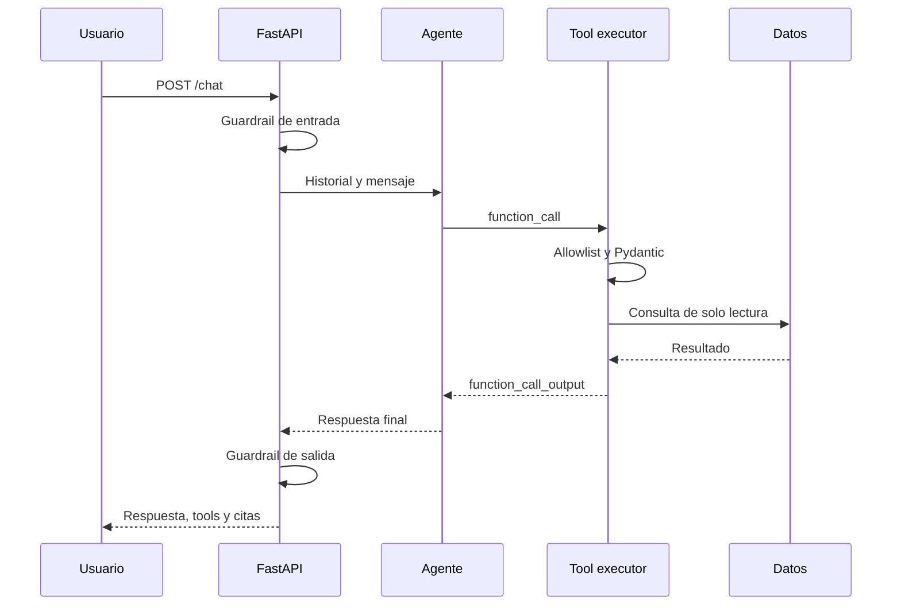

# Arquitectura y decisiones

## Objetivo

El sistema responde consultas de una ferretería sin permitir que el modelo se
convierta en la autoridad sobre datos o permisos. La aplicación conserva la
propiedad del bucle: valida entradas, ejecuta herramientas y registra resultados.

## Capas

| Capa | Responsabilidad |
|---|---|
| `api` | HTTP, dependencias, autorización y contratos |
| `services` | Orquestación de agente, RAG y guardrails |
| `repositories` | Consultas y persistencia |
| `models` | Entidades SQLAlchemy |
| `schemas` | Entrada y salida Pydantic |
| `core` | Configuración, errores, logs y seguridad |

## Flujo de chat

## Proveedores

`demo` permite:

- Ejecución offline.
- Tests determinísticos.
- Evals sin costo.
- Demostración para un reclutador.

`openai` permite:

- Respuestas generativas.
- Decisión de herramientas.
- Bucle de function calling.
- Embeddings semánticos.

Ambos cumplen el mismo contrato externo.

## RAG

Los documentos se dividen por caracteres buscando cortes naturales y
manteniendo solapamiento. Cada fragmento conserva:

- Documento.
- Posición.
- Fuente.
- Metadatos.
- Contenido.
- Embedding.

La búsqueda de demostración carga los vectores y realiza similitud coseno
exacta. Esta decisión reduce infraestructura y vuelve el proyecto ejecutable.
No pretende reemplazar un índice ANN en gran escala.

## Memoria

La memoria se guarda en dos tablas:

- `conversations`
- `messages`

Las salidas de herramientas también se guardan. Esto permite inspeccionar no
solo qué respondió el agente, sino los datos que utilizó.

## Escalabilidad

Una evolución de producción puede:

- Sustituir búsqueda exacta por pgvector o un vector store administrado.
- Agregar Redis para límites y caché.
- Enviar trabajos de ingesta a una cola.
- Usar autenticación OAuth2/JWT.
- Separar observabilidad en OpenTelemetry.
- Ejecutar múltiples réplicas detrás de un balanceador.
